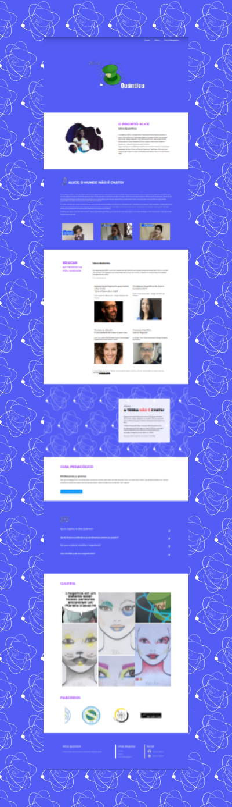

# Alice Quântica


__Made with:__
HTML, CSS, JS

__What is this?__
Website for Alice Quântica project

__Website:__
<a href="https://alice-quantica.herokuapp.com/">Alice - Heroku App</a>

__Description:__
This is a website of the Alice Project, which started in 2015, and had its first act at staging the play Quantum Alice.

__Figma:__
<a href="https://www.figma.com/file/kc8VdJwwNkRMkT5z6FHXAD/Alice-Qu%C3%A2ntica?node-id=0%3A1">Click here to see</a>

__Behance:__
Coming soon

# Quick links &#128150;
  
[PROJECT SETUP](#Project-setup) &diams; [PREVIEW](#Preview) &diams; [TESTING](#Testing) &diams; [STATUS OF THE PROJECT](#How-is-the-development-of-the-project-right-now) &diams; [CREDITS](#Credits) &diams; [BACK TO TOP](#Alice-Quantica)


# Project setup
```
Open index.html on the browser bro
```

# Preview



# How is the development of the project right now?
__Last update:__ 02/03/2022

We are working at the first version of the website :)

# Credits

Lorem ipsum dolor sit amet

__Thank you for your support!__

_... And stay awesome Gothan!_
  
[PROJECT SETUP](#Project-setup) &diams; [PREVIEW](#Preview) &diams; [TESTING](#Testing) &diams; [STATUS OF THE PROJECT](#How-is-the-development-of-the-project-right-now) &diams; [CREDITS](#Credits) &diams; [BACK TO TOP](#Alice-Quantica)
